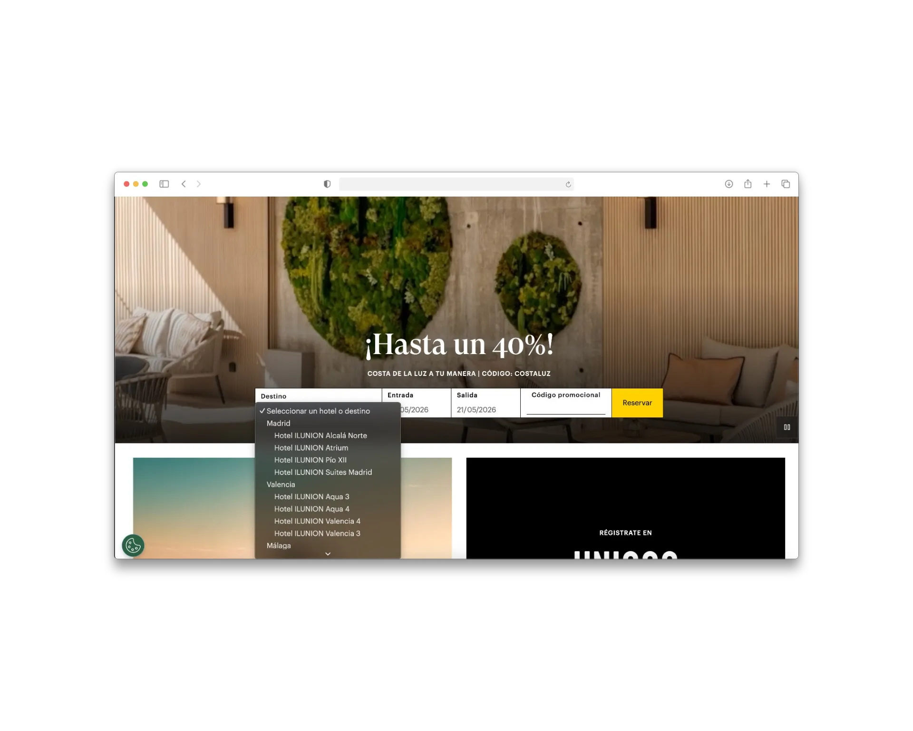
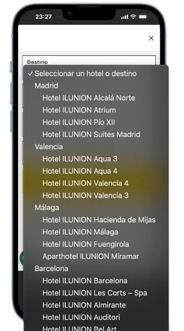

# El reto y el problema (TASK)

El reto consistía en analizar el comportamiento del acceso al motor desde una perspectiva UX y CRO para detectar puntos de abandono y proponer una solución más clara, escalable y alineada con los objetivos comerciales.

La solución debía:
- funcionar correctamente en desktop y mobile
- convivir con campañas activas
- mantener coherencia con la identidad visual
- y adaptarse a las limitaciones técnicas de Adobe Experience Manager.

El problema principal no era visual. La experiencia estaba construida desde una lógica más corporativa e inspiracional, mientras que gran parte del tráfico llegaba con una intención claramente transaccional. Existía una desalineación entre el modelo mental del negocio y el comportamiento real del usuario.

### Antes del rediseño

  

    
<strong>Desktop</strong>

    
  

  

    
<strong>Mobile</strong>

    
  

