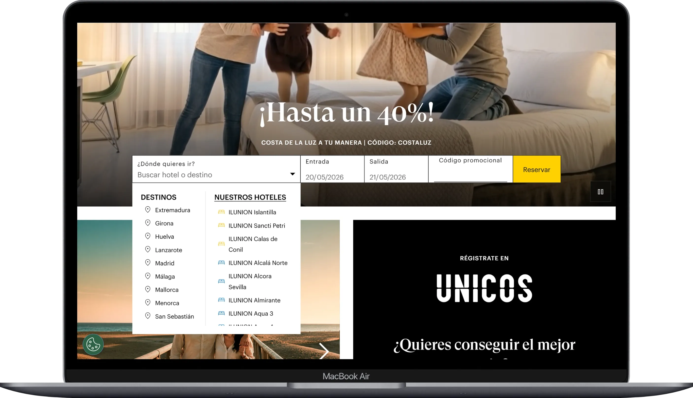
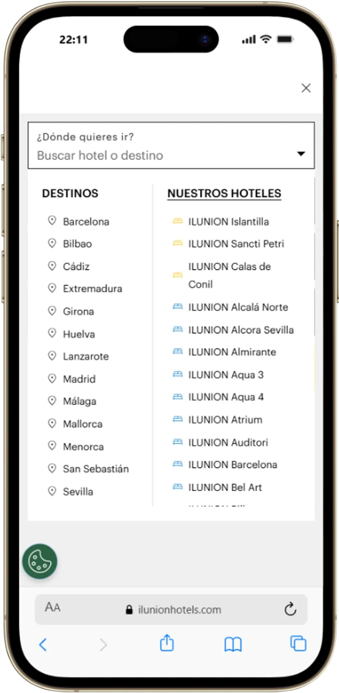

# Diseño (ACTION)

A partir del análisis, redefiní la jerarquía del acceso al motor priorizando:
- rapidez de identificación
- claridad visual
- reducción de fricción
- y facilidad de interacción.

La estrategia se centró en aumentar la visibilidad del inicio de búsqueda, simplificar la lectura, reducir competencia entre elementos, y facilitar interacciones rápidas desde tráfico de alta intención. Trabajé la relación entre promociones, contenido inspiracional, y motor de reservas, para evitar conflictos entre objetivos dentro de la misma pantalla.

### Resultado del diseño

  

    
<strong>Desktop Rediseñado</strong>

    
  

  

    
<strong>Mobile Rediseñado</strong>

    
  

