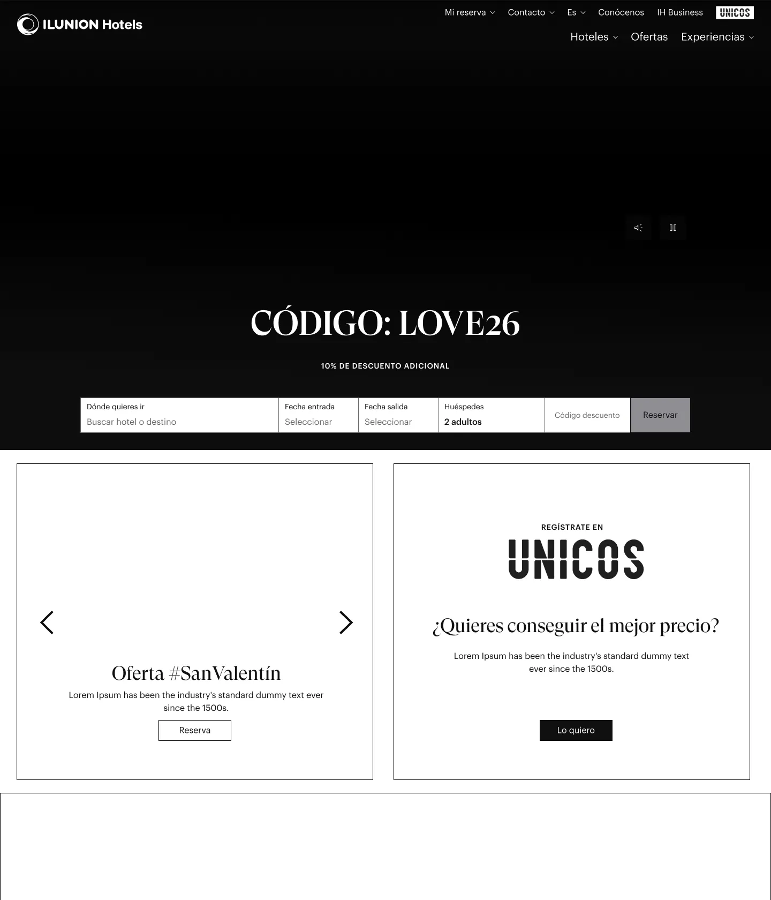
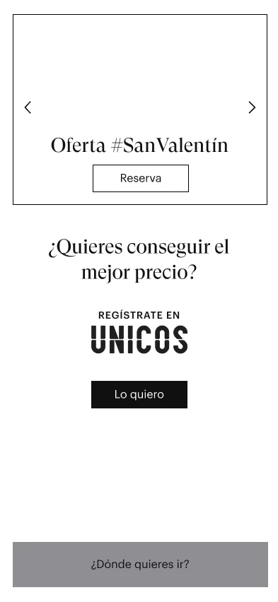
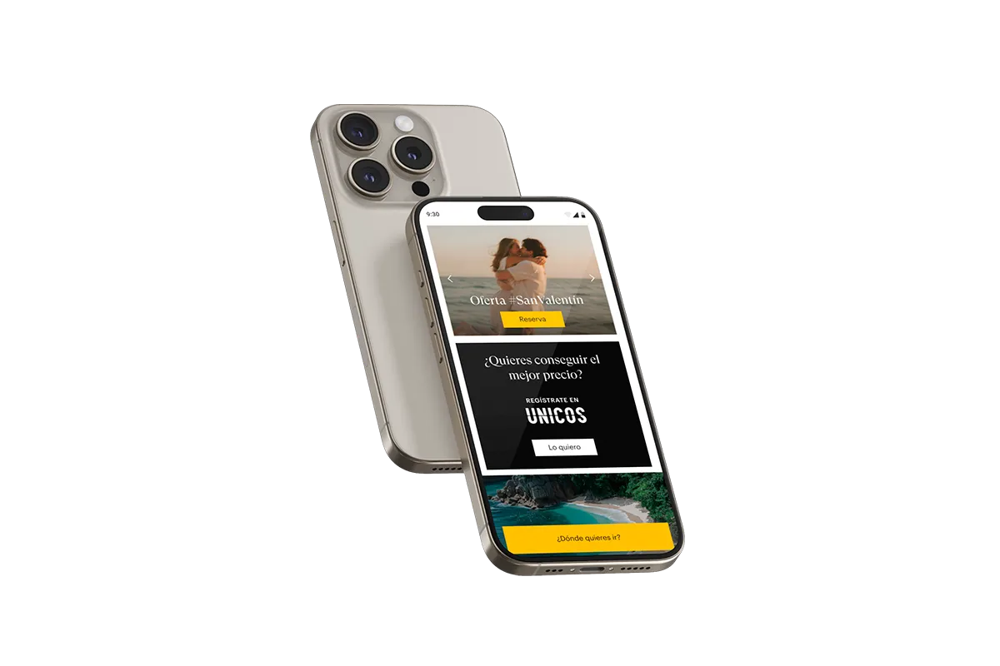

# 05 Diseño (UI / UX Strategy)

El rediseño del componente de ofertas se basó en los principios del Systems Thinking. El objetivo era crear un componente modular, altamente escalable y que redujera drásticamente la fricción cognitiva.

### Proceso: Wireframing y Arquitectura de Información

Antes de pasar a UI de alta fidelidad, estructuramos la jerarquía del componente mediante wireframes, priorizando el precio, el título de la oferta y el call to action (CTA).

  

    
<strong>Wireframe Desktop</strong>

    
  

  

    
<strong>Wireframe Mobile</strong>

    
  

### Resultado Final: UI Premium y Responsive

El diseño final establece un nuevo estándar visual (clean layout, sombras sutiles, microinteracciones) y resuelve el problema del scroll en mobile mediante el uso estratégico del espacio horizontal y tarjetas compactas.

  

    
<strong>Diseño Final Desktop</strong>

    
  

  

    
<strong>Diseño Final Mobile</strong>

    
  

